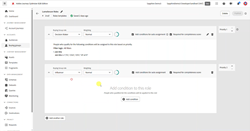

# [!DNL Journey Optimizer B2B Edition] チュートリアル

[!DNL Journey Optimizer B2B Edition] を最大限に活用する方法を説明します。 組み込みのジェネレーティブ AI と業界をリードする自動化を使用して、アカウントと購入グループジャーニーを調整し、特定の製品に対する需要を最大化します。

>[!NOTE]
>
>その他のビデオも近日公開予定です。

## 最新情報 {#whats-new}

* [ 購入グループの概要 ](/help/buying-groups/buying-groups-overview.md)
  _購入グループとその使用方法について説明します。_

* [ 購入グループの作成 ](/help/buying-groups/create-a-buying-group.md)
  _アカウントオーディエンス、役割テンプレート、ソリューションへの関心を使用して購入グループを作成する方法を説明します。_

* [ ソリューションの関心 ](/help/buying-groups/solution-interest.md)
  _購入グループソリューションの関心と、購入グループを作成する際にそれらを設定/使用する方法について説明します。_

## 最も人気のあるビデオ {#most-popular-videos}

<table>
<tr>
<td>

<a href="/help/buying-groups/buying-groups-overview.md"><strong> 購入グループの概要 </strong></a>

</td>
<td>

<a href="/help/buying-groups/create-a-buying-group.md"><strong> 購入グループの作成 </strong></a>

</td>
<td>

<a href="/help/buying-groups/role-templates.md"><strong> 役割テンプレート </strong></a>

</td>
</tr>
</table>
